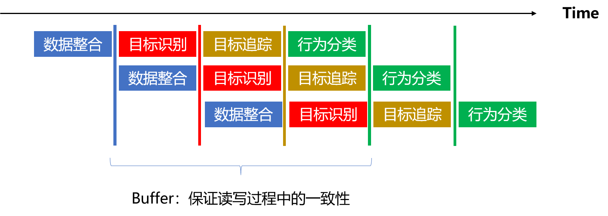

## Deep Learning Pipeline Architecture (DeepPipeline)

### 1. 概述

在深度学习中，很多实际业务场景中的任务是多阶段的，可拆解的任务。如图1，以行为识别为例，在使用RGB视频流进行行为识别时，我们可以将整体工作流分为四个步骤（数据采集、目标识别、目标追踪、行为分类）。如果四个步骤串行运行，则会占用大量的时间。如果四个步骤可以同时运行，往往可以使串行占用大量时间的方法在实际业务中实时进行。

框架设计宗旨为：**解耦，可复用，易理解，高性能。**



#### 1.1 使用环境

本框架可以在python3.5+的环境中运行，无需额外的Python依赖包。

#### 1.2 Python依赖

为避免Python语言多线程的GIL，我们计划使用如下Python自有的库：

- multiprocessing：多进程保证多核CPU并行使用（可以选择多进程模型）；

- Time&Queue：时间戳保证Queue作为Buffer中信息的交换中介；多线程锁保证读写一致性；

### 2. 如何使用

#### 2.1 快速使用

1. 首先我们需要编写不同阶段的处理任务，比如：

   ```python
   class stage_one(Stage):
       def stage_run(self, x):
           time.sleep(0.5)
           x.append("stage one")
           return x
   ```
   其中，每个单阶段任务都必须继承DeepPipeline包中的Stage类，并实现stage_run(x)方法，y = stage_run(x)中输入x是上一阶段的输出，返回值y是本阶段的处理结果。
   
2. 除了正常的单阶段处理任务，我们还需要定义一下流水线最终的输出任务（比如：视频展示、数据保存），这时我们依然需要继承DeepPipeline中的Stage类，不过不需要返回值。以如下程序为例：
   ```python
   class stage_end(Stage):
    def stage_run(self, x):
        print(x)
   ```
   
3. 在定义完成所有的单阶段任务后，我们需要实例化DeepPipeline包中的Pipeline类，并指明最终的输出阶段。以如下程序为例（其中，multiprocess为True时，调用多进程，为False时，调用多线程）：
   ```python
   P = Pipeline(stages = [one, two, three], end_stage = end, buffer_size = 2, multiprocess=False)
   ```
   其中，one, two, three, end为继承了Stage类并实现了stage_run函数的类的实例。buffer_size=2为不同阶段之间的缓冲区大小（进行相邻阶段之间的信息交互）。
   
4. 运行整体工作流：
   ```python
   P.start()
   ```
   在框架启动后，我们可以使用Pipeline类中的put函数来为框架添加输入：
   ```
   P.put("Something Stage one can process.")
   ```
5. 再完成所有的工作后，我们可以调用Pipeline的setstop引导所有子程序结束，：

   ```
   P.setstop()
   ```

   

以上介绍的整体测试代码如下：

```python
from DeepPipeline import Pipeline, Stage
import time

class stage_one(Stage):        
    def stage_run(self, x):
        time.sleep(0.5)
        x.append("stage one")
        return x

class stage_two(Stage):
    def stage_run(self, x):
        time.sleep(0.5)
        x.append("stage two")
        return x

class stage_three(Stage):
    def stage_run(self, x):
        time.sleep(0.5)
        x.append("stage three")
        return x

class stage_end(Stage):
    def stage_run(self, x):
        print(x)


if __name__ == '__main__':
    one = stage_one()
    two = stage_two()
    three = stage_three()
    end = stage_end()

    P = Pipeline(stages = [one, two, three, end], buffer_size = 2, multiprocess=True)
    P.start()
    
    for i in range(1, 11):
        try:
            P.put(["Pipeline: {}".format(i)])
            time.sleep(0.3)
        except (Exception,KeyboardInterrupt) as ep:
                raise ep
    P.setstop()
```

最终输出为：

```python
['Pipeline: 1', 'stage one', 'stage two', 'stage three']
['Pipeline: 2', 'stage one', 'stage two', 'stage three']
['Pipeline: 3', 'stage one', 'stage two', 'stage three']
['Pipeline: 5', 'stage one', 'stage two', 'stage three']
['Pipeline: 7', 'stage one', 'stage two', 'stage three']
['Pipeline: 8', 'stage one', 'stage two', 'stage three']
['Pipeline: 9', 'stage one', 'stage two', 'stage three']
['Pipeline: 10', 'stage one', 'stage two', 'stage three']
```
#### 2.2 Stage类
每个单阶段任务都必须继承DeepPipeline包中的Stage类，并实现stage_run(x)方法，y = stage_run(x)中输入x是上一阶段的输出，返回值y是本阶段的处理结果。
   ```python
class stage_one(Stage):
    def stage_run(self, x):
        time.sleep(0.5)
        x.append("stage one")
        return x
   ```

对于`y = stage_run(x)`函数，x一般为上一阶段的单个样本输出，y为本阶段数据处理的单个样本输出。当我们需要多个样本输入时（需要上一阶段在缓存区所有的输出时），需要对实例化后的类进行`set_get_all()`，以如下程序为例：

```python
one = stage_one()
one.set_get_all()
```

同理，我们也可以指定当前阶段需要单个样本输入（默认为单个样本输入）：
```python
one = stage_one()
one.set_get_single()
```

#### 2.3 Pipeline类

Pipeline类有如下可选参数进行实例初始化：

```python
P = Pipeline(stages = [one, two, three, end], buffer_size = 2, multiprocess=True)
```

其中：

- stages: list[Stage]，多阶段类（Stage）子类的实例化的列表；

- buffer_size: list or int，相邻阶段的数据交换缓冲区大小，如果是list类型，必须和stage的长度一致，比如：当存在4个单阶段任务时，buffer_size的列表大小为4。

  【对于buffer_size，我们为每个阶段都准备了一个buffer作为输入，因此共有len(stages)的列表大小。】

在一切准备完成后，我们只需要运行整体工作流：
   ```python
   P.start()
   ```
在框架启动后，我们可以使用Pipeline类中的put函数来为框架添加输入：
   ```
   P.put("Something Stage one can process.")
   ```
